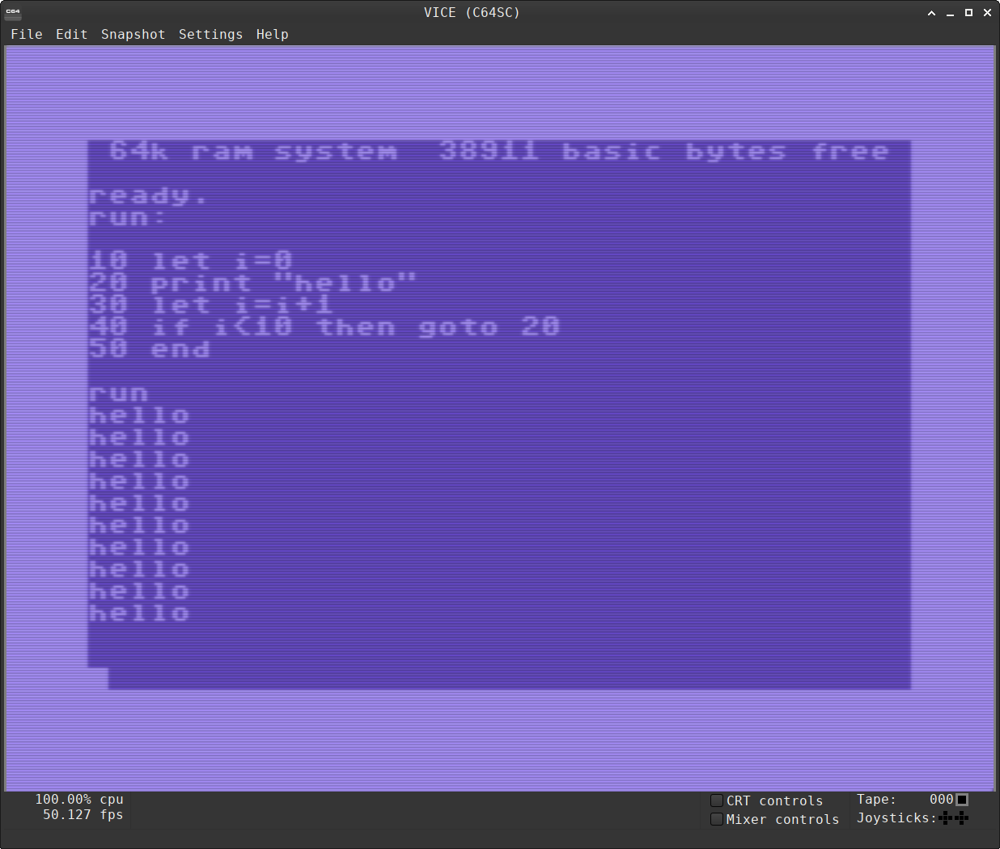

# TINY64

This repository contains a simple C program to replicate the original Tiny Basic Interpreter Virtual Machine as described by Dennis Allison in People's Computer Company Vol. 4, No. 2 on a Commodore 64.

<br>



<br>

---
# INFO

## REQUIREMENTS

- cc65 (to build the program)
- VICE Emulator (to run the program)

## BUILD

    make

## RUN

    make run

## RUN (alternative)

    x64sc -autostartprgmode 1 program.prg

---
## Language summary

**NOTE** : on the emulator all the keywords must be **lowercase**

```
INPUT varlist  
LET var = expr  
PRINT exprlist  
GOTO expr 
IF expr (=,>,<,>=,<=,<>) expr THEN statement  
GOSUB expr  
RETURN  
END  
RUN  
LIST  
CLEAR
EXIT ( to terminate the virtual machine )
```
---
## Sample program

```
10 LET I = 0
20 PRINT "HELLO WORLD"
30 LET I = I + 1
40 IF I < 10 THEN GOTO 20
50 END
```
